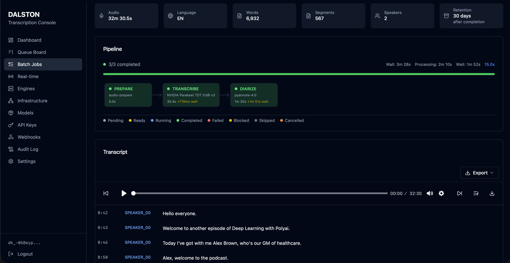

# Dalston

[](LICENSE)
[](https://www.python.org/downloads/)

**Ollama for ASR.** Run open-source speech recognition models on your machine or private cloud. Freedom from proprietary APIs, full privacy, no quality compromise.



## Why Dalston

**Pluggable and extensible** — Mix and match transcription, alignment, diarization, and PII detection models. Swap components without breaking your pipeline. Completely open source and free.

**Drop-in integration** — OpenAI and ElevenLabs compatible APIs mean you can point your existing code at Dalston and it just works. Need more power? The native Dalston API unlocks advanced functionality like multi-engine routing, pipeline customization, and detailed engine metadata.

**Cheap to run** — `make dev` is free. A 1-hour podcast on a spot GPU costs cents. A 24/7 ElevenLabs/OpenAI-compatible API on AWS runs around $87/month all-in. See the [cost estimator](docs/guides/51-aws-cost-estimator.md).

## What It Does

Transcribe audio files or live streams with speaker diarization, word-level timestamps, and GPU acceleration. Run it on your own infrastructure.

```bash
# One-command local transcription (M57 zero-config bootstrap)
# - auto-starts local server if missing
# - auto-ensures default model (distil-small)
DALSTON_SECURITY_MODE=none dalston transcribe tests/audio/test_merged.wav --format json
```

```json
{
  "text": "Hello, welcome to the meeting...",
  "segments": [
    {"speaker": "SPEAKER_01", "start": 0.0, "end": 2.5, "text": "Hello, welcome to the meeting."},
    {"speaker": "SPEAKER_02", "start": 2.8, "end": 5.1, "text": "Thanks for having me."}
  ]
}
```

## Quick Start

```bash
git clone https://github.com/ssarunic/dalston.git && cd dalston
make dev      # full local stack on Docker
```

For zero-Docker single-process mode or AWS deployment, see the [guides](docs/guides/).

## Features

- **Batch & Real-time** — File uploads or WebSocket streaming
- **Speaker Diarization** — Identify who said what
- **Word Timestamps** — Precise timing for every word
- **OpenAI & ElevenLabs Compatible** — Drop-in replacement for existing integrations
- **Modular Engines** — Faster Whisper, NeMo Parakeet, Voxtral, Pyannote, and more
- **Private by Default** — Runs entirely on your infrastructure, no data leaves your environment

## Documentation

**Start here:**

- [Quickstart](docs/guides/01-quickstart.md) — first transcript in 5 minutes
- [Pick your deployment](docs/guides/02-pick-your-deployment.md) — laptop / spot GPU / 24/7 AWS
- [All guides →](docs/guides/) — engines, real-time, cost, principles

**Engineering reference:**

- [Architecture](docs/specs/ARCHITECTURE.md) · [REST API](docs/specs/batch/API.md) · [WebSocket API](docs/specs/realtime/WEBSOCKET_API.md)

## License

[Apache 2.0](LICENSE)
